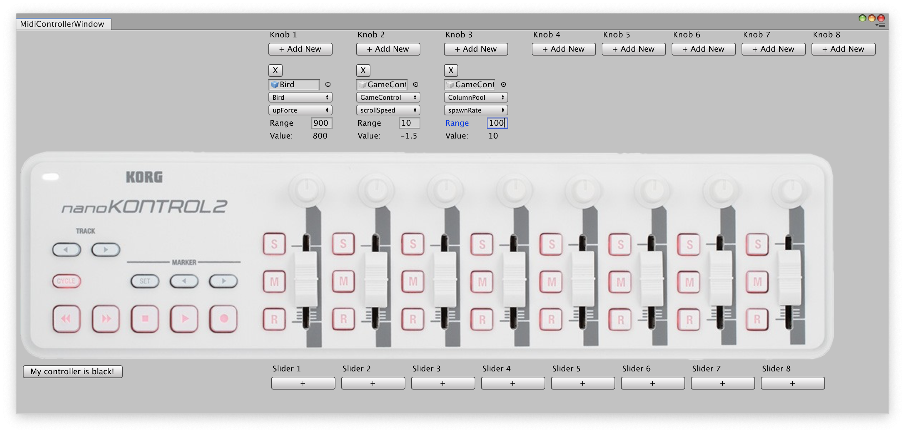
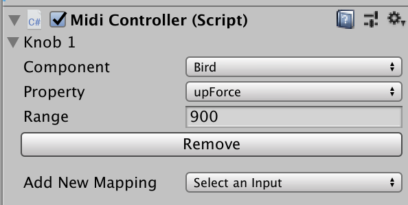

# GroundKontrol &nbsp;  &nbsp;  &nbsp; 

Ground Kontrol is a library that aims to make it easy to tweak and tune your Unity game's constants and magic numbers using a [Korg NanoKontrol 2](https://www.amazon.com/Korg-nanoKONTROL2-Slim-Line-Control-Surface/dp/B004M8UZS8) MIDI controller.

It was introduced during the Tech Toolbox panel at the 2019 Independent Games Summit. That talk should be made available at some point in the future on the GDC Vault; this README will be updated when that happens.

## Installation

Clone this git repo, and copy the `GroundKontrol` folder into your Unity project's `Assets/Plugins` folder.

If you have a Korg NanoKontrol 2 hooked up to your computer, and haven't changed its mappings using its desktop tool, it should just work.

## Usage

There are two ways to use GroundKontrol.

### The GroundKontrol Editor Window

Select Window -> GroundKontrol from Unity's menubar. 

To wire up a given knob or slider to a specific variable, click "Add New" for that knob/slider. Drag in the GameObject or prefab you want to modify, then pick the component and property from the dropdown.

**Range** specifies what numbers the knob/slider's values will represent. When the slider or knob is at its lowest point, it will be zero; `range` specifies what the top end will be.

You can wire up multiple mappings to the same single knob or slider.

### The `MidiController` component / inspector window

When you add a mapping via the editor window, it adds a `MidiController` component to that GameObject. If you open the inspector panel for a given object or prefab, the `MidiController` component has its own custom inspector UI that also lets you wire up new mappings that way. 

You can also manually add the `MidiController` component to any object and set things that way.

Changes made in the inspector panel will take effect in the window, and vice versa.

**Warning**: If you have an object open in the inspector, and make changes in the editor window that affect that object, there will be unexpected and undesirable behavior. Make sure to close your inspector pane before opening the GroundKontrol editor window!

### Runtime

TODO: Note about button to hold

Once you click play, things will just work. While the game is running, you

### Saving Data Back

## Development

If you want to hack on GroundKontrol, you should be able to just edit the files directly.

Because Unity doesn't (to my knowledge) know how to deal with assets that aren't within its project structure, there are two separate copies of the library: the one that lives in the root of this project, and one that lives in `Sample/Assets/Plugins/GroundKontrol`. 

For development purposes, it's probably easier to make changes to the copy within `Sample`. If you have the Sample project open in Unity, you'll be able to see your changes live in real-time.

When you're happy with your changes and want to commit them, run `npm run sync` to copy those changes back to the root copy (or just copy/paste them). This isn't great (and means there's duplicate copies of everything in git) but it seems like the least-bad solution for now to enable a functioning dev environment.

## License

GroundKontrol is licensed under the MIT license. See the LICENSE file in this repo for more information.

## Contact

**Em Lazer-Walker**

* https://github.com/lazerwalker
* https://twitter.com/lazerwalker